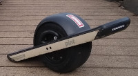

# Onewheel Pint

[Official Page](https://onewheel.com/products/pint)

## Specs

* Range: 6-8 miles range
* Top speed: 15mph
* Tire: 5.0/10.5-6
* Charge time: 120 minutes
  * Ultracharger: 50 minutes
* Features
  * Wet-weather hardened
    * (Except bearings)
  * Maghandle
  * Simplestop

## Reception

The stock tire is not highly regarded, but the quoted range is understated, with people getting far more range than expected.  The wet-weather hardening is a big improvment on the XR.

## Hardware

* Motor: 750W hub motor
* Battery: 147WH
* Charger: 63v
  * Standard: [1.3A](https://www.reddit.com/r/onewheel/comments/cks79d/pint_chargerultracharger_amperage/)
  * [Ultracharger](https://onewheel.com/products/pint-ultracharger): 50 minutes 

### Model Numbers

  * 5300
    * Firmware: Gemini - 5042
  * 5301
    * Firmware: Gemini - 5040
    * Firmware: Gemini - 5050
  * 5314
    * Firmware: Gemini - 5050

[Source](https://www.reddit.com/r/onewheel/comments/efoxzx/pint_hardwarefirmware_versions_bluetooth/)

# Useful Info
* Tire slime refill amount: [4.1oz](https://www.reddit.com/r/onewheelpint/comments/ggj5mf/bestcheapest_place_to_buy_replacement_tires/fqx2n31?utm_source=share&utm_medium=web2x)
